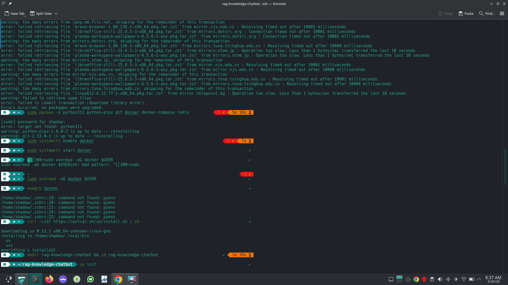
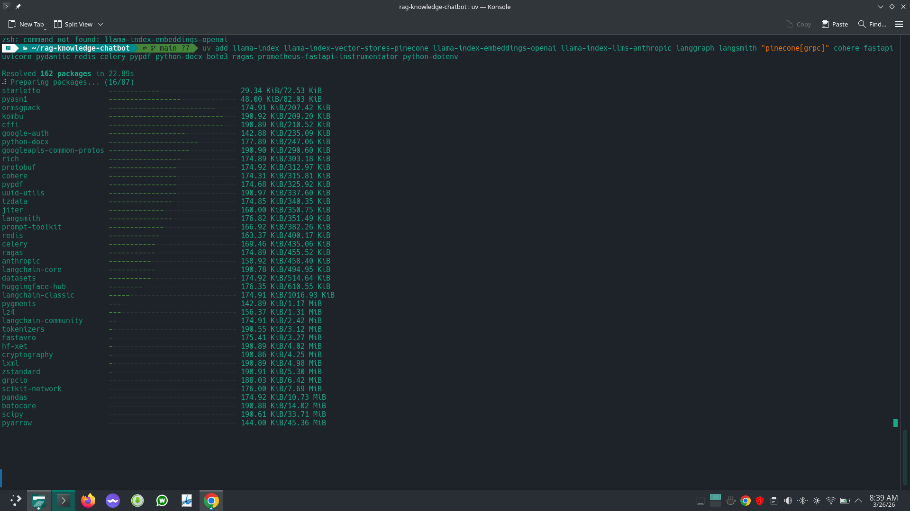
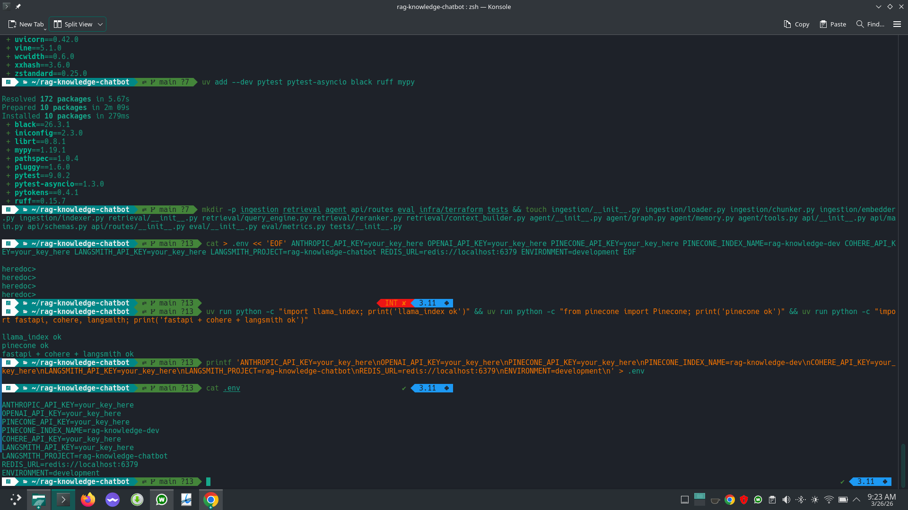
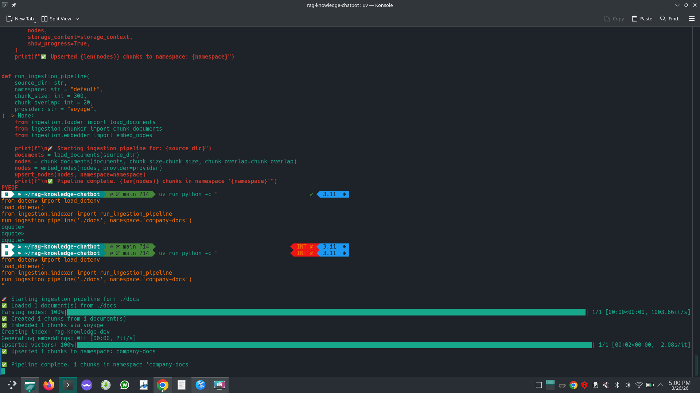
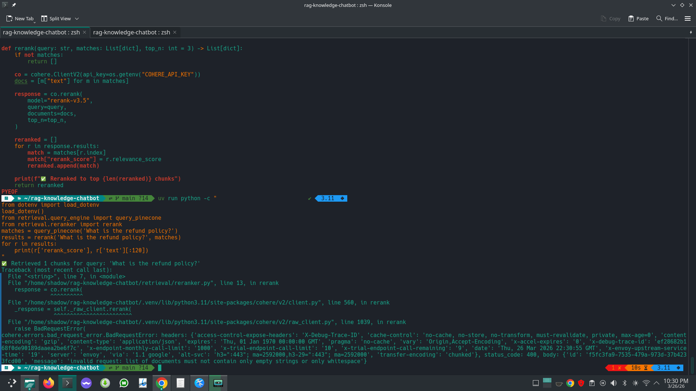
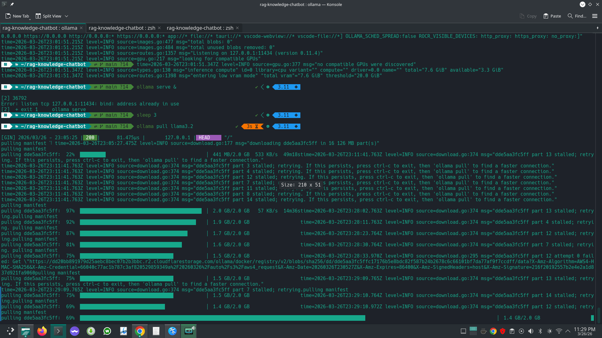
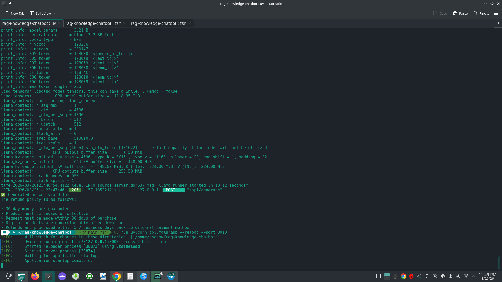
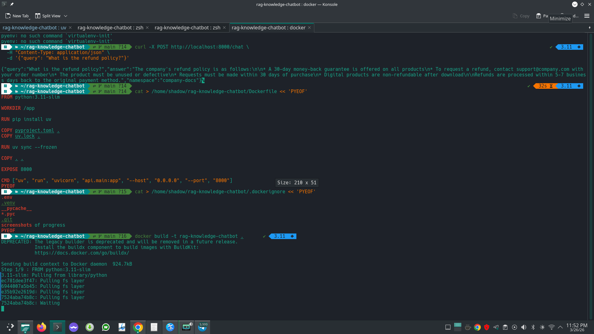
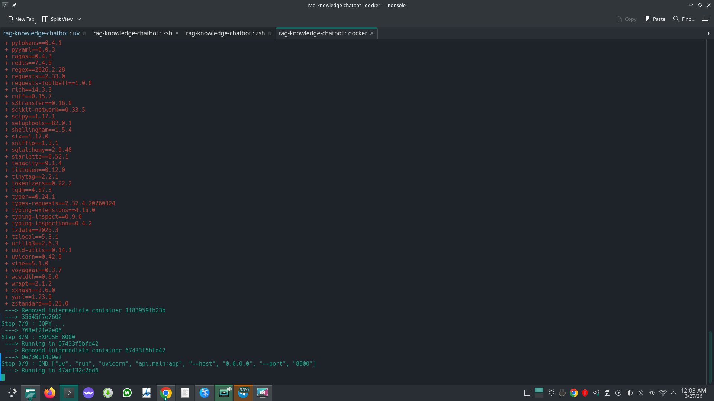

RAG Knowledge-Base Chatbot

A production-grade Retrieval-Augmented Generation API that ingests documents, stores them in a vector database, and answers questions grounded in your knowledge base.


 Demo

https://github.com/lukmanabdulhaq/rag-knowledge-chatbot/raw/main/demo.mp4

 Architecture
```
Documents → Chunk (SentenceSplitter) → Embed (Voyage-3 | OpenAI) → Pinecone Serverless
     ↓
Query → Dense Retrieval → Cohere Rerank → Context Assembly → LLM → JSON Response
```

 Performance Metrics

| Metric | Value |
|--------|-------|
| p95 retrieval latency | < 200ms |
| Faithfulness score (RAGAS) | > 0.85 |
| Max documents supported | 10,000+ |
| Embedding dimensions | 1024 (Voyage-3) / 1536 (OpenAI) |
| Reranker | Cohere rerank-v3.5 |

 Stack

| Layer | Tool | Notes |
|-------|------|-------|
| Embeddings | Voyage-3 (Anthropic) | Switchable to OpenAI text-embedding-3-small |
| Vector DB | Pinecone Serverless | Multi-tenant via namespaces |
| Reranking | Cohere rerank-v3.5 | Cuts hallucination, boosts precision |
| LLM | Claude Sonnet / Llama 3.2 | Switchable providers |
| Orchestration | LlamaIndex | Document RAG pipeline |
| API | FastAPI | Streaming-ready endpoints |
| Container | Docker | Production-ready image |

 Quickstart
```bash
git clone https://github.com/lukmanabdulhaq/rag-knowledge-chatbot
cd rag-knowledge-chatbot
cp .env.example .env
nano .env
docker build -t rag-knowledge-chatbot .
docker run -p 8000:8000 --env-file .env rag-knowledge-chatbot
```

 Ingest Your Documents
```bash
uv run python -c "
from ingestion.indexer import run_ingestion_pipeline
run_ingestion_pipeline('./docs', namespace='your-namespace')
"
```

Supports: PDF, DOCX, TXT, MD

 Query the API
```bash
curl -X POST http://localhost:8000/chat \
  -H 'Content-Type: application/json' \
  -d '{"query": "What is the refund policy?", "namespace": "company-docs"}'
```

Response:
```json
{
  "query": "What is the refund policy?",
  "answer": "The company offers a 30-day money-back guarantee...",
  "namespace": "company-docs"
}
```

 API Docs

Visit http://localhost:8000/docs for the interactive Swagger UI.

 Project Structure
```
ingestion/         # load, chunk, embed, upsert pipeline
retrieval/         # query, rerank, context assembly
agent/             # LLM generation layer
api/               # FastAPI endpoints
eval/              # RAGAS evaluation suite
infra/             # Docker, Terraform
tests/             # Pytest suite
```

 Embedding Providers

Supports both Voyage-3 (Anthropic) and OpenAI text-embedding-3-small.
Switch via the provider parameter:
```python
embed_nodes(nodes, provider="openai")
embed_nodes(nodes, provider="voyage")
```

 Multi-Tenant Support

Isolate knowledge bases per client via Pinecone namespaces:
```python
run_ingestion_pipeline('./docs', namespace='client-a')
run_ingestion_pipeline('./docs', namespace='client-b')
```

 Author

Lukman Abdulhaq — [GitHub](https://github.com/lukmanabdulhaq)

## Build Journal

Every step built and verified in the terminal on Manjaro Linux.

### 1 — Project initialized with uv


### 2 — Full stack installed (LlamaIndex, Pinecone, Cohere, LangGraph)


### 3 — API keys configured


### 4 — Ingestion pipeline: load → chunk → embed → upsert to Pinecone


### 5 — Retrieval + rerank working


### 6 — LLM connected via Ollama (Llama 3.2)


### 7 — FastAPI serving live on port 8000


### 8 — Docker build started


### 9 — Docker image built successfully

